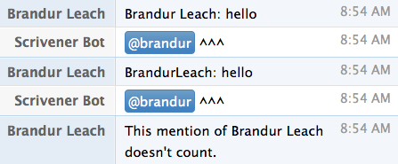

# Scrivener

Acts as a helper between XMPP and HipChat so that when an XMPP client does a "soft mention" a user's name (i.e. just their nick), that mention is converted to a HipChat-style "hard mention" (their configured @-name) so that the user being mentioned is actually notified.

The bot uses the HipChat API to get the names of all the rooms that it's able to connect to and the mappings of users' real names to "mention names", then connects to each room using XMPP and listens for mentions in new messages.

This shouldn't be necessary. If you find this bot as annoying as I do, please [vote for HipChat to fix their XMPP support](http://help.hipchat.com/forums/138883-suggestions/suggestions/2979786-xmpp-group-chat-nicknames).



## Prerequisites

Scrivener requires a HipChat account to make an XMPP connection and an API `auth_token` with **admin** privileges.

## Configuration

* `AUTH_TOKEN`: API key for looking up rooms and users. Must have **admin** privileges.
* `IGNORE_USERS`: Nicks to ignore, i.e. whose messages are not searched for mentions.
* `NICK`: Nick to be assigned to the Scrivener bot.
* `XMPP_ID`: Jabber ID, e.g. `27879_289875@chat.hipchat.com/bot`.
* `XMPP_PASSWORD`: Password of bot's HipChat account.

## Run Locally

```
gem install foreman
vi .env # add AUTH_TOKEN, NICK, XMPP_ID, XMPP_PASSWORD
foreman start
```

## Platform Deploy

```
heroku create
heroku config:add AUTH_TOKEN=
heroku config:add NICK=
heroku config:add XMPP_ID=
heroku config:add XMPP_PASSWORD=
git push heroku master
heroku ps:scale worker=1
```
